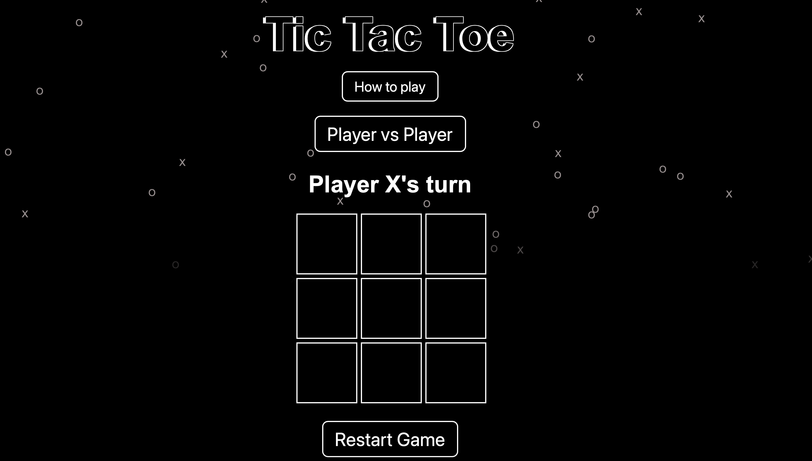
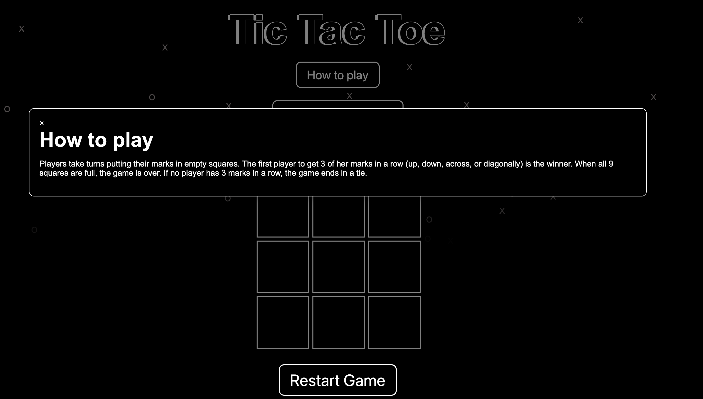
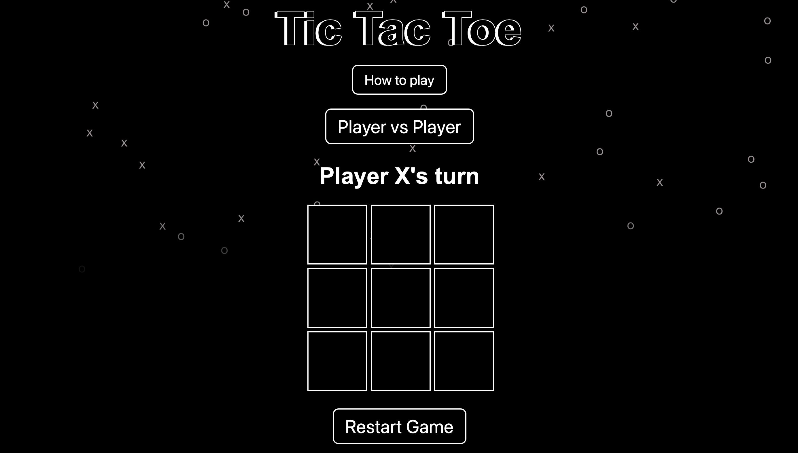
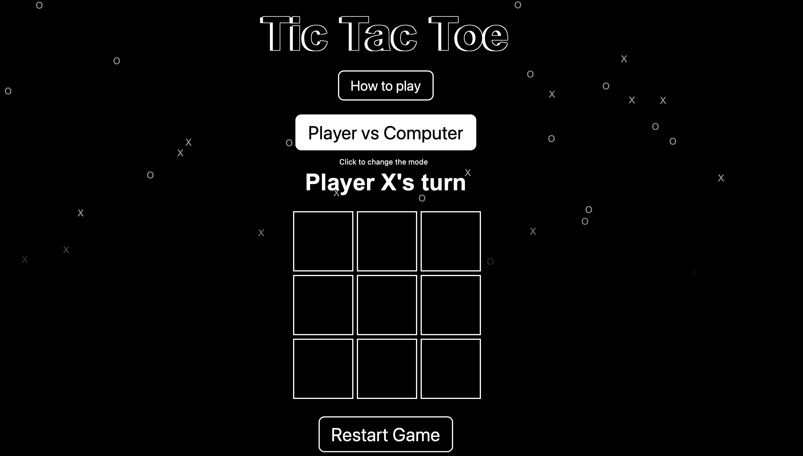
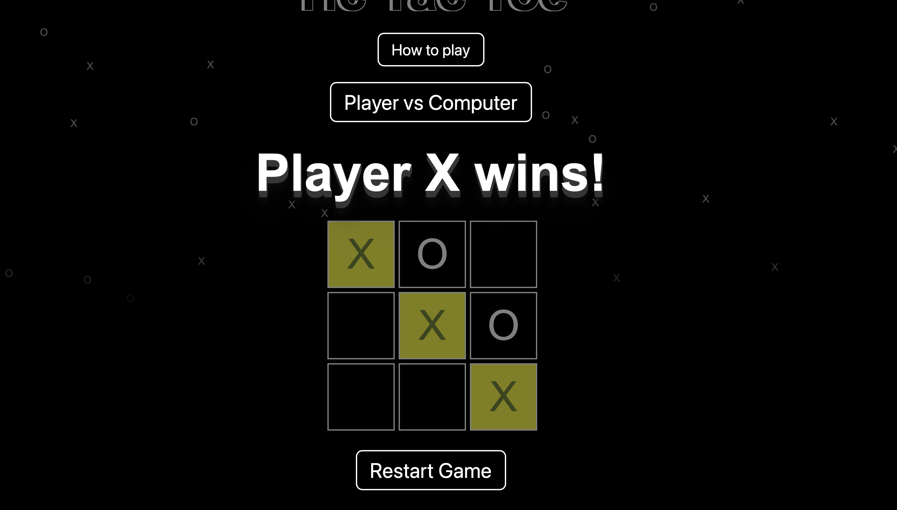
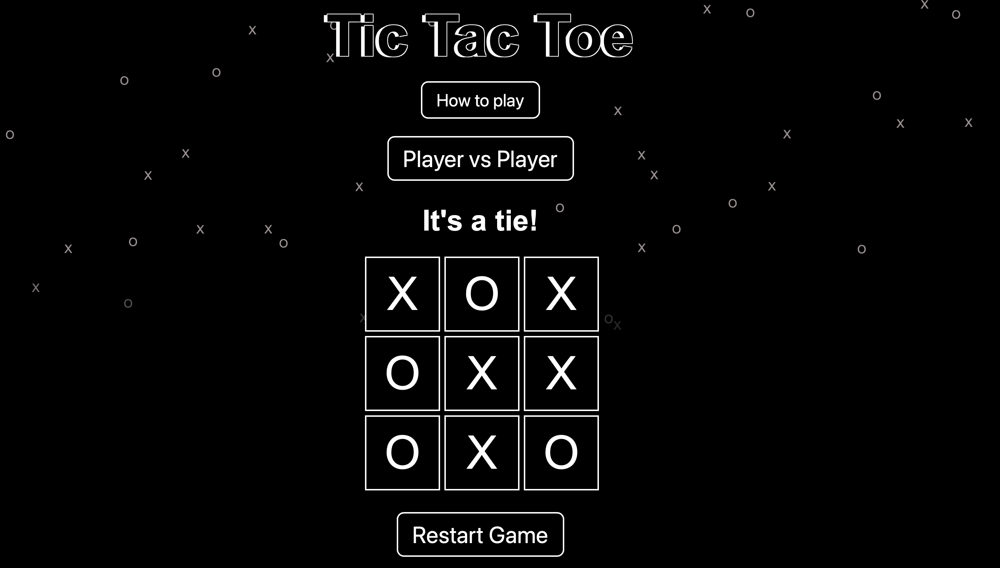

# tic-tac-toe

Welcome to the Tic Tac Toe game project as part of CSI3140 assignment

## Description
This project is a  Tic Tac Toe game built with HTML, CSS, and JavaScript.

## Features
- Player-Player or Player-Computer gameplay
- Interactive UI
- Winning message display
- Falling X's and O's animation

## Design System
For detailed information about the design system used in this project, please refer to the [Design System](docs/design_system.md).

## Screenshots 

### Initial Game Interface

### Rules

### Player vs Player Mode

### Player vs Computer Mode

### Winning state

### It's a tie state

## How to Play
1. Start the game by clicking on any cell.
2. Players take turns clicking on empty cells to place their mark (X or O).
3. The game ends when one player gets three marks in a row (horizontally, vertically, or diagonally) or all cells are filled without a winner.

## Setup
To run this project locally:
1. Clone the repository.
2. Open `index.html` in your web browser.
