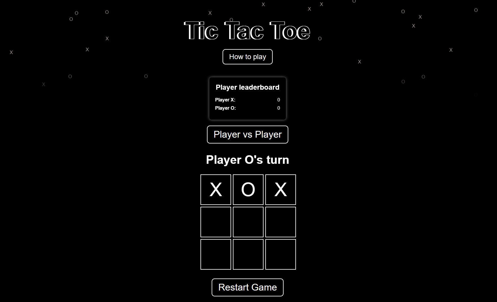

# tic-tac-toe

Welcome to the Tic Tac Toe game project as part of CSI3140 assignment.

## Description
This project is a  Tic Tac Toe game built with HTML, CSS, JavaScript, and PHP.

## Features
- Player vs Player
- Player vs Computer gameplay
- Interactive UI
- Winning message display
- Falling X's and O's animation

## Design System
For detailed information about the design system used in this project, please refer to the [Design System](docs/design_system.md).

## Screenshots

### Initial Game Interface

### Rules

### Player vs Player Mode

### Player vs Computer Mode

### Winning state

### It's a tie state

## How to Play
1. Start the game by clicking on any cell.
2. The player (X) plays against the computer (O), placing an X on their turn and having the computer subsequently place an O, or, the player may play against another player.
3. The game ends when one player gets three marks in a row (horizontally, vertically, or diagonally) or all cells are filled without a winner.

## Setup
To run this project locally with the PHP component:
1. Clone the repository.
2. Navigate to the project location within CMD.
3. Use: php -S localhost:9000
4. Navigate to http://localhost:9000 in your web browser.
